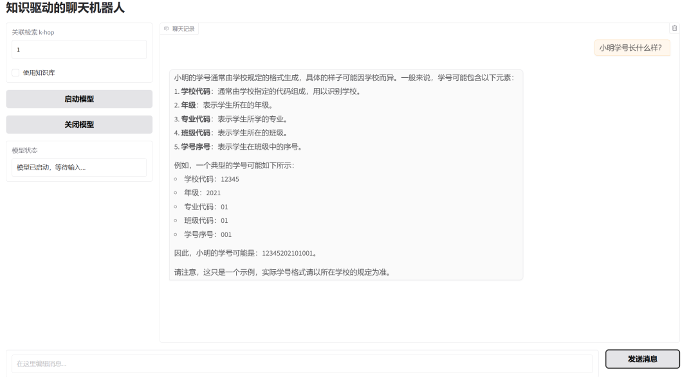
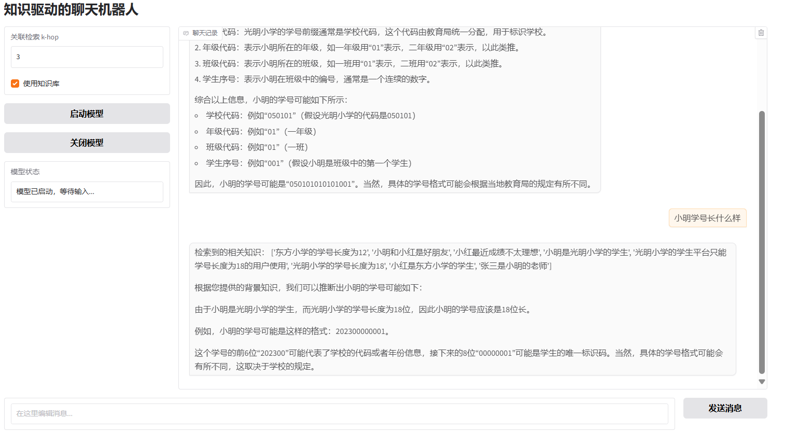

# 知识驱动的聊天机器人
## 简介
基于大语言模型的聊天机器人已经成为行业主流，但是受大语言模型自身原理所限，聊天机器人只能基于“世界知识”进行问答。对于一些私人问题或者小众领域问题往往表现较差，从学术方面来讲，这样的AI还不够智能，从商业方面来讲这样的AI也没法作为商品进行销售。所以针对这一现象，该项目尝试基于向量检索与深度学习模型结合的方式实现了一个知识驱动的聊天机器人，我们将模型部署至服务器，使用SSH进行远程连接，在本地使用Gradio框架构建Web界面，实现与聊天机器人模型的生动交互。

## 基本原理
通过加载预定义的知识库并将其转化为向量索引，机器人能够基于用户输入进行相似度搜索，结合相关知识内容生成回答。在知识检索部分，采用了 FAISS 库进行高效的向量相似度搜索，使用 HuggingFace 提供的多语言嵌入模型将文本转化为向量。回答生成部分使用了 THUDM 提供的 GLM-4-9B-Chat 预训练语言模型，该模型能够基于自然语言输入生成高质量的回答。

## 实现细节

### 知识库构建
使用搜索引擎搜索到现成的三元知识图谱数据，筛选其中部分三元组一条一条地转换为自然语言知识，并且以id-content的格式构建出JSON知识库文件，约600条左右。筛选三元组的原则是：先人工选定一个主体，找出所有与其相关的三元组，再在这些三元组中把客体作为主题继续寻找相关三元组纳入知识库。对于疾病类知识，直接将一种疾病的所有相关三元组纳入知识库。最后人工加入一些知识条目用于测试。

### 构建向量索引
通过 BAAI/bge-m3嵌入模型将知识库中的内容转化为向量表示，并通过 FAISS 构建向量索引。build_vector_store 函数会创建一个 FAISS 向量索引，用于快速查找与查询最相似的文档。

### K跳搜索
基于查询进行多跳搜索，通过递归逐步扩展知识库的检索范围。k 代表搜索的跳数，每次跳转都会进一步查询匹配文档，以找到更多相关知识。

## 效果展示

## 待完善工作
该项目仅仅通过句子的向量嵌入之间的相似度来选取与用户发言相关的知识，这样的方法会受向量嵌入质量的影响，尽管引入了K跳搜索来提高知识匹配的精度，但是该模型对于用户提问的句子长短和提问方式以及知识库的大小还是比较敏感。

目前的设想如下：吸取操作系统的经验，引入“多级页表”。

在构建知识库时我们提取知识的关键词，如“上海的天气是晴”，我们从中提取“上海”、“天气”，在用户提问“上海今天天气怎么样”的时候，我们并不直接把该句转换为向量与知识库的向量进行比对，而是对用户提问也进行抽取关键词，抽取出“上海”、“天气”，然后与知识库中关键词匹配，在“上海”&“天气”的小范围内进行向量相似度计算并匹配，这样既能提高知识查询速度也能提高匹配准确度，防止无关但向量相似的知识的干扰。该过程可以做成多级，比如匹配到关键词后再匹配关键句，最终匹配到有关知识。
